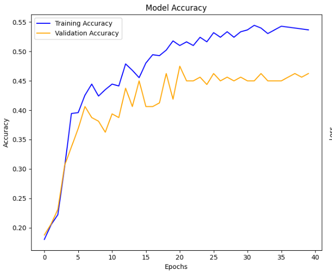

# Projects

## Decision Tree from Scratch
Implemented using NumPy with 70% accuracy.

## CNN for Digit Recognition
Achieved 99% accuracy on MNIST using PyTorch.

## Music Equalizer Recommender
Combined CNN+RNN models to recommend equalizer settings based on music genre.

[Back to Home](./index)
